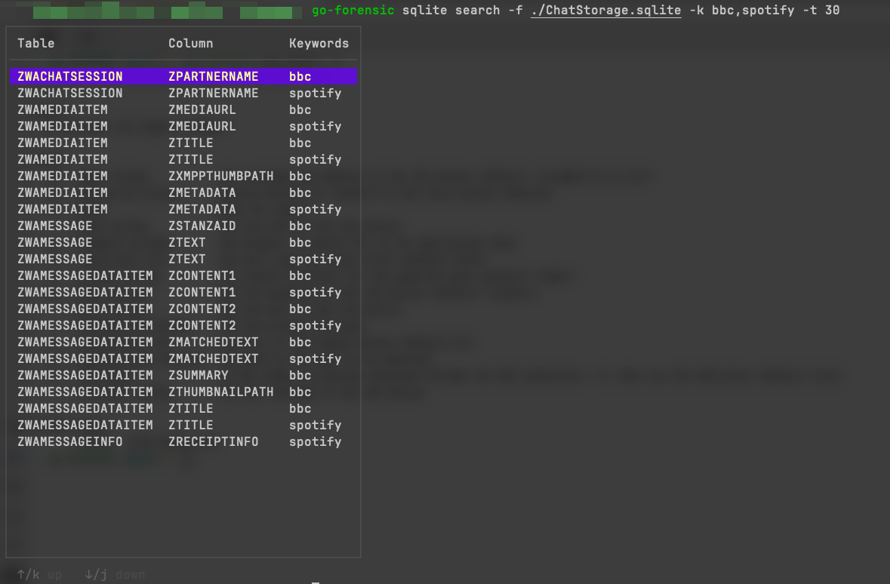

# go-forensic

A forensic tool🔧 for mobile phone.

This tool is designed to make it easier to get the app's data when you have already obtained the maximum permissions of your phone's iOS/Android system. Also provide some simple analyzing functions.


## Prerequisites

### iPhone

- Jailbreaking
- OpenSSH

### Android

- root

### Local PC

- Go 1.20+ installed
- platform-tools(use adb for Android)

## Install

Need to add the bin directory under GOPATH to the PATH environment variable.

```
go install github.com/solywsh/go-forensic@latest
```

## Features

- iOS: Export data from iOS applications or specified file paths using the SSH protocol. Supports data extraction via USB reverse proxy SSH protocol.
- Android: Export data from Android applications or specified file paths using adb.
- Sqlite: Globally search for tables and columns containing multiple keywords.

```
> go-forensic -h

go-forensic is a tool developed to address the lack of integrated
features in some forensic tools, with the intention of improving
the efficiency of mobile forensics work.

Usage:
  go-forensic [flags]
  go-forensic [command]

Available Commands:
  android     go-forensic processes commands related to the Android system
  completion  Generate the autocompletion script for the specified shell
  help        Help about any command
  ios         go-forensic processes commands related to the iOS system
  sqlite      processing sqlite database related commands
  version     version subcommand show go-forensic version info.

Flags:
      --debug   show debug info
  -h, --help    help for go-forensic

Use "go-forensic [command] --help" for more information about a command.
```

## How to use

### Usage Instructions Before Use

The go-forensic tool can only extract data using keywords from Package Name (Android) or Bundle ID (iOS), or by specifying a path.

For iOS applications, goforensic will search for the `.com.apple.mobile_container_manager.metadata.plist` file in the following directories to match the `MCMMetadataIdentifier`.

```
/private/var/mobile/Containers/Data/Application
/private/var/mobile/Containers/Shared/AppGroup
```

They are basically equivalent to the Bundle ID, but the data obtained from the same application in the `Application` and `AppGroup` directories is inconsistent.

WhatsApp as an example:

```
Application: net.whatsapp.WhatsApp
AppGroup: group.net.whatsapp.WhatsApp.shared（or other）
```

So, if you want to fully extract data from a certain application, it’s best to **use the keywords they all have**.

```
go-forensic ios export -k whatsapp
```

Or write them all:

```
go-forensic ios export -k net.whatsapp.WhatsApp,group.net.whatsapp.WhatsApp.shared
```

Of course, specifying the path is also possible.

If you don't know what the Bundle ID of an app is, you can go to [offcornerdev](https://offcornerdev.com/bundleid.html) or [qimai(for China user)](https://www.qimai.cn/) to check.

### iOS

1. List all iOS devices connected via USB

```
go-forensic ios device list
```


2. Export iOS device data

Export iOS WhatsApp and Signal data (default uses the first device connected via USB, default username is root, password is alpine).

```
go-forensic ios export -k whatsapp,signal
```

Export to the `.\temp` directory

```
go-forensic ios export -k whatsapp -o ./temp
```

Specifying a USB device

```
go-forensic ios export -k whatsapp -d 00008110-001A399114FB801E
```

Export data from WhatsApp and the `/private/var/Keychains` directory

```
go-forensic ios export -k whatsapp -s /private/var/Keychains
```

Specify username and password

```
go-forensic ios export -k whatsapp --username haha -p 114514
```

Connect without using USB reverse proxy, specify the Host and port of the iOS device:

```
ios export -k whatsapp --host 192.168.1.11 -port 22 -o ./temp
// or
go-forensic ios export -k whatsapp -a root@192.169.1.11:22 -p 114514 -u false -o ./temp
```


3. Use USB reverse proxy port on iOS

Proxy the TCP port 22 of the iOS device to the local port 2222:

```
// default value
go-forensic ios proxy
// or
go-forensic ios proxy -l 2222 -r 22 -p tcp
```

Designated device (Device ID can be partial):

```
go-forensic ios proxy -d 00008110
```


### Android

Export data from QQ And the `/sdcard/Download/QQ` directory

```
go-forensic android export -k qq -s /sdcard/Download/QQ -o ./temp
```


### Sqlite

Global search for tables and columns containing the keywords bbc and spotify

```
go-forensic sqlite search -f ./ChatStorage.sqlite -k bbc,spotify
```

Specify the height of the table to be displayed

```
go-forensic sqlite search -f ./ChatStorage.sqlite -k bbc,spotify -t 30
```



## Thanks

https://github.com/electricbubble/go-usbmuxd-device